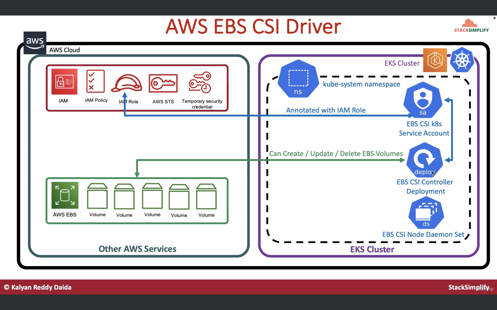
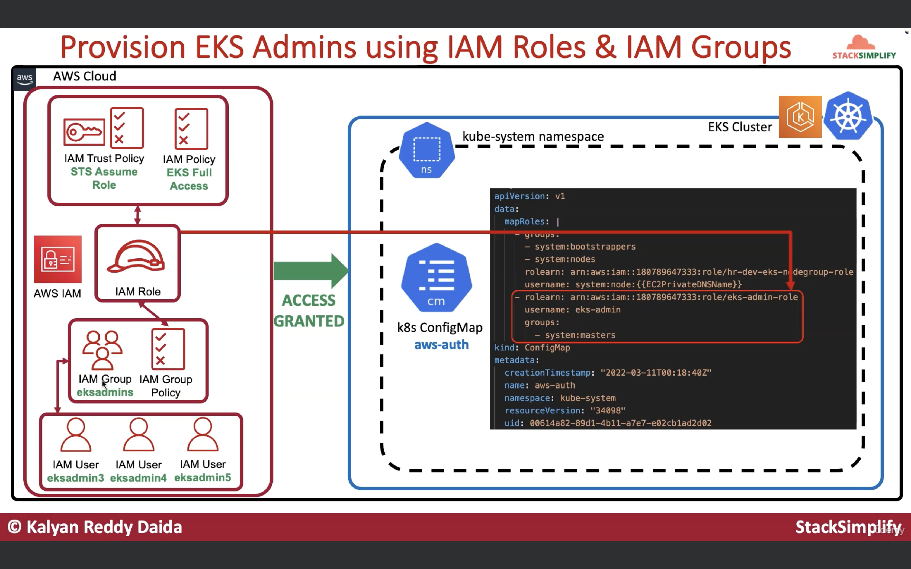

# PRACTICAL TERRAFORM & KUBERNETES ON AWS EKS

## 🚀 What I Learned

Without the incredible [Terraform on AWS EKS Kubernetes course](https://www.udemy.com/course/terraform-on-aws-eks-kubernetes-iac-sre-50-real-world-demos/?couponCode=LETSLEARNNOWPP) 📚 and the [accompanying GitHub repository](https://github.com/stacksimplify/terraform-on-aws-eks) 💻, I would not have been able to learn and master the extensive range of concepts and practical skills I possess today 🚀.

**AWS VPC and Bastion Host Setup**

1. Creating a 3-tier VPC
2. Configuring a Bastion host

- 📂 [**01-aws-vpc-bastion**](path/to/01-aws-vpc-bastion)

**AWS EKS Basics**

1. Setting up EKS clusters
2. Configuring Public and Private Node Groups

- 📂 [**02-aws-eks-basics**](path/to/02-aws-eks-basics)

**AWS EKS IRSA Implementation**

1. Configuring IAM Roles for Service Accounts (IRSA)
2. Automating IRSA with Terraform

- 📂 [**03-aws-eks-irsa**](path/to/03-aws-eks-irsa)

**AWS EKS Storage**

1. Installing AWS EBS CSI Controller
2. Automating installation with Terraform

- 📂 [**04-aws-eks-ebs**](path/to/04-aws-eks-ebs)

**Managing AWS EKS IAM Users**

1. Creating IAM users and roles
2. Integrating with EKS

- 📂 [**05-aws-eks-iam-users**](path/to/05-aws-eks-iam-users)

**AWS EKS IAM Roles**

1. Configuring IAM roles for EKS
2. Assigning roles to users and groups

- 📂 [**06-aws-eks-iam-roles**](path/to/06-aws-eks-iam-roles)

**AWS EKS IAM Read-Only Access**

1. Setting up read-only roles
2. Configuring access control

- 📂 [**07-aws-eks-iam-read-only-role**](path/to/07-aws-eks-iam-read-only-role)

**AWS EKS Developer Access**

1. Setting up developer access roles
2. Configuring namespaces and role bindings

- 📂 [**08-aws-eks-iam-developer-access**](path/to/08-aws-eks-iam-developer-access)

**AWS Load Balancer Controller**

1. Installing the AWS load balancer controller
2. Creating 14 ingress service demos

- 📂 [**09-aws-eks-lb**](path/to/09-aws-eks-lb)

**ExternalDNS with AWS Load Balancer**

1. Configuring ExternalDNS with ALB
2. Setting up DNS records

- 📂 [**09-aws-eks-lb-externaldns**](path/to/09-aws-eks-lb-externaldns)

**AWS EKS EFS Setup**

1. Installing AWS EFS CSI Driver
2. Static and dynamic provisioning

- 📂 [**11-aws-eks-efs-install**](path/to/11-aws-eks-efs-install)
- 📂 [**12-aws-eks-efs-static-provisioning**](path/to/12-aws-eks-efs-static-provisioning)
- 📂 [**13-aws-eks-efs-dynamic-provisioning**](path/to/13-aws-eks-efs-dynamic-provisioning)

**Kubernetes Autoscaling**

1. Cluster Autoscaler
2. Horizontal and Vertical Pod Autoscalers

- 📂 [**14-aws-eks-cluster-autoscaler**](path/to/14-aws-eks-cluster-autoscaler)
- 📂 [**15-aws-eks-horizontal-pod-autoscaler**](path/to/15-aws-eks-horizontal-pod-autoscaler)
